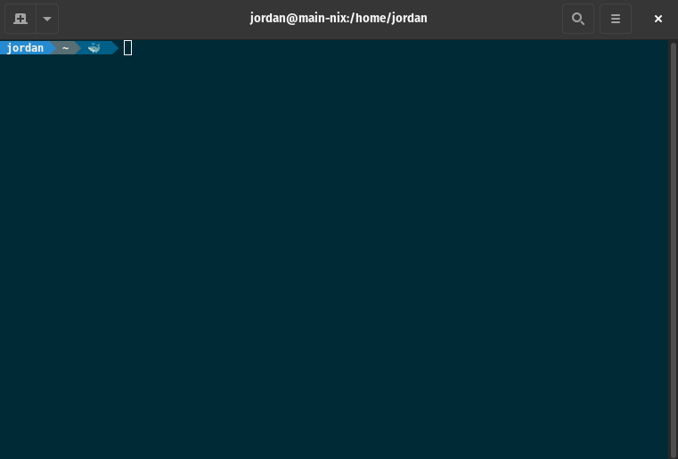

# terminal-branch-win-title

A small shell function that includes the current git branch (if present) to a 
terminal emulator's window title.

## Requirements

- [git](https://git-scm.com) v2.2 or higher 
- Any supported [terminal emulator](#terminal-emulator-support)
- Any supported [shell interpreter](#shell-interpreter-support)

## Quick Start

Configuration may vary depending on the user's OS, terminal emulator, and shell
interpreter. But in most cases, the following command should be enough:

```bash
$ source branch-win-title.sh
```

You may also want to add this line to your shell configuration file
e.g. `.profile`, `.bashrc`, etc.

## Terminal Emulator support

Tested on the following terminal emulators:

- [gnome-terminal](https://github.com/GNOME/gnome-terminal)
- [guake](https://github.com/Guake/guake) (some options need to be enabled)
- TODO: Test out on [iTerm2](https://github.com/gnachman/iTerm2)

## Shell interpreter support

- [bash](https://www.gnu.org/software/bash)
- TODO: Add [zsh](https://github.com/zsh-users/zsh) support

## Additional configuration

### Powerline

The `branch-win-title` function must be loaded first before configuring
powerline otherwise it will override the powerline-generated shell prompt.

### Guake

Enable the following settings under `Main Window`:

- Show tab bar
- Use VTE titles for tab names

### Tmux

Add the following entries to `.tmux.conf`:

```bash
set-option -g set-titles on
set-option -g set-titles-string "#T"
set-option -g automatic-rename on
```

## Demo


